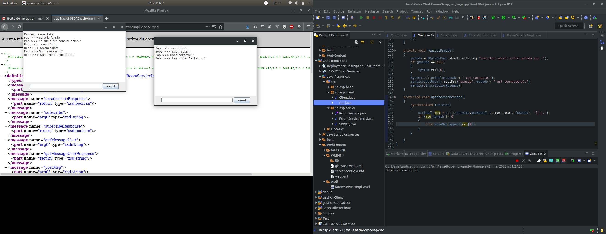

#Java Soap ChatRoom

Un simple ChatRoom ou salon de discussion en français, avec `Java` et le protocole `SOAP`.

## Architecture du projet

Pour une meilleur organisation, le projet est découpé suivant les `packages` suivants :

- `sn.esp.bean` contient les classes metiers de l'app (ici `User.java` et `Message.java`).

- `sn.esp.client` contient tout ce qui concerne la partie client comme l'interface graphique (`Gui.java`)
ainsi que la logique d'interaction avec le serveur soap (`Client.java`).

- `sn.esp.server` contient tout ce qui concerne le serveur.

## Notes

Vous devez disposer au moins d'un serveur `Tomcat` afin de démarrer le projet !
Pour effectuer cette dernière, démarrer d'abord le Serveur Saop via le fichier `Server.java` au niveau du package `sn.esp.server`, puis exécuter le programme `Gui.java` situé dans `sn.esp.client`.

Bon chat !!!!

